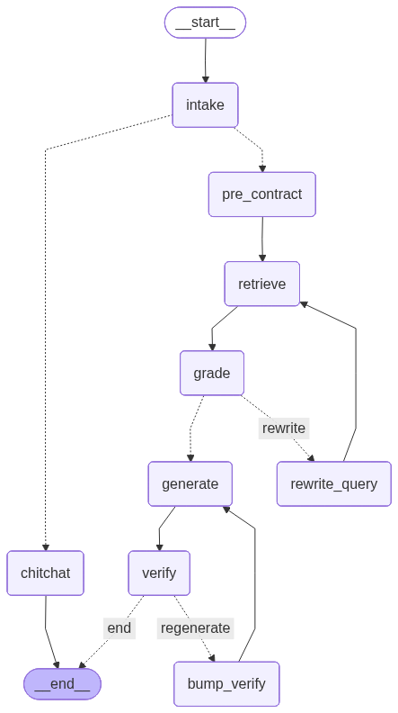
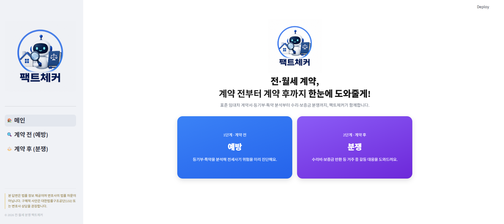
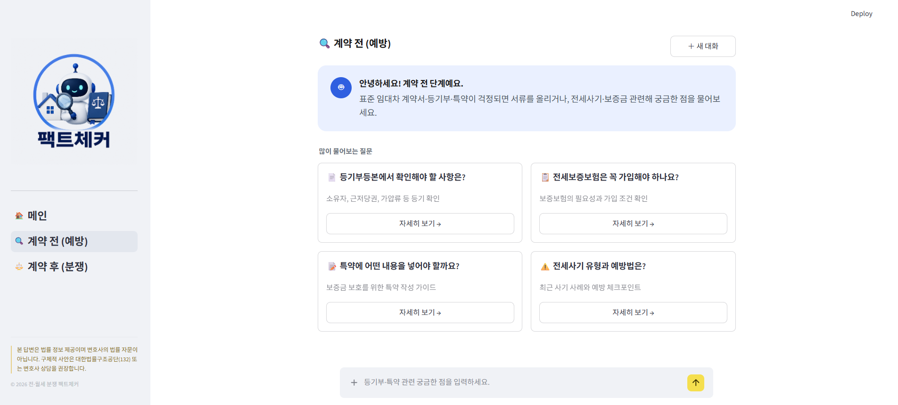
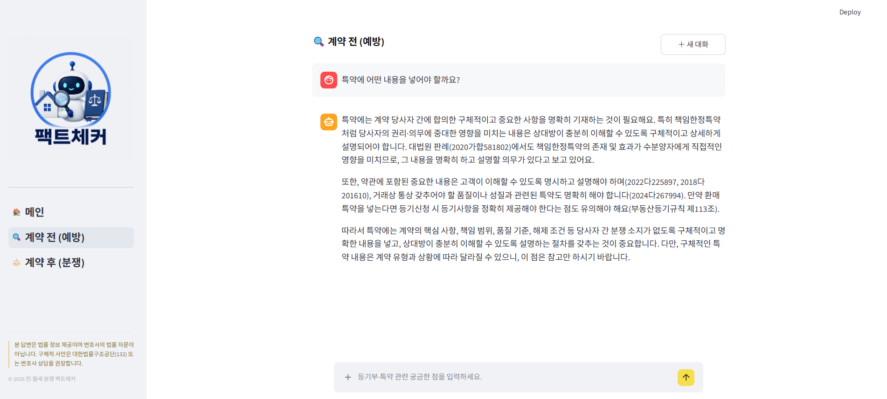
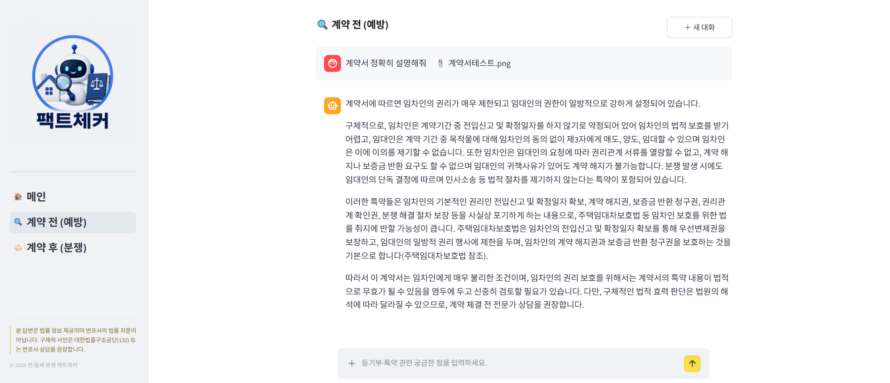

# 전·월세 분쟁 팩트체커

> 계약 전 예방부터 계약 후 분쟁까지, 법령·판례로 따져주는 세입자 법률 도우미

**홈쉴드(HomeShield)** — 전·월세 계약과 분쟁에서 세입자의 권리를 지키기 위해 법령과 판례를 근거로 위험을 검증하는 주거 안전 보호팀 (SKN30 3차 프로젝트 · 4조)

| 팀원 | 역할 |
|------|------|
| **김진남** | 팀장 · 랭그래프 설계 · DB · 성능평가 |
| **정민규** | 데이터 전처리·청킹 · 성능평가 |
| **정주애** | 데이터 수집·임베딩 · 프론트 |
| **천성배** | 데이터 수집·프롬프트 엔지니어링 · 성능평가 |

## 왜 만들었나

전세사기 피해자는 누적 3.4만 명+, 그중 74.7%가 20·30대다. HUG 전세보증 사고액은 최근 5년 11조 원을 넘었고, 사고의 약 70%가 전세가율 90% 초과 구간에서 발생했다 — **위험은 등기부와 전세가율에서 미리 읽을 수 있었다.**

'확인만 했으면 막을 수 있었던 위험'을 **계약 전**에 진단하고, **계약 후**에는 법령·판례 근거를 쥐여주는 것이 이 프로젝트의 목표다.

## 차별점 — 계약 전 + 계약 후 투트랙

- 🛡️ **계약 전 (예방)** — 등기부·계약서 OCR 분석 → 근저당·선순위·특약 추출 → 전세가율 계산 → 깡통전세 위험 진단
- ⚖️ **계약 후 (분쟁 대응)** — 수리 책임·보증금 반환·계약갱신 분쟁을 법령 조항·판례 사건번호를 인용해 상담

계약 전 진단만 하는 서비스와 달리, **계약 후 분쟁 후처리까지** 멀티턴 대화로 지원한다.

## 핵심 기능

- 📄 **OCR 서류 판독** — 계약서·등기부 PDF/이미지 다중 업로드 → GPT-4o Vision 텍스트 추출 → 위험 요소 자동 분석
- 🔍 **근거 인용 상담** — 답변마다 법령명·조항 / 법원·사건번호 명시, 효력 위계(법령·판례 > 사례) 층 분리
- 💬 **멀티턴 세션** — 대화 맥락으로 지시대명사를 해소해 이어지는 질문도 정확히 검색
- 🚫 **환각 제어** — 답변이 검색 근거에 충실한지 검증(verify)하고 불충실하면 재생성, 정량 계산은 LLM이 아닌 결정론 코드가 담당

## 아키텍처 (LangGraph)



```
intake(의도 분류) → chitchat(잡담: 검색 없이 응답)
                 └→ pre_contract 서브그래프(OCR → 서류 분석 → 전세가율 → 위험 판정)
                    → retrieve → grade(유사도 결정론 게이트)
                       ↺ rewrite_query(재검색 루프 ≤2)
                    → generate → verify(환각 검증)
                       ↺ 재생성 루프 ≤1
```

- **grade**: LLM 없이 검색 유사도로 근거 충분성 판정 (top-1 ≥0.45 충분 / <0.35 재작성) — 지연·비용 0
- **멀티턴**: MemorySaver + thread_id 체크포인터로 상태 유지, 매 턴 그래프 재호출
- 상세 구조: [src/core/graph.py](src/core/graph.py)

## 데이터 & 검색

| 출처 | 내용 |
|------|------|
| 국가법령정보센터 API | 법령 16종 (주택임대차보호법 등) · 판례 6개 쟁점 · 법령해석례 |
| 공공 PDF 16종 | 임대차분쟁조정 사례집(2021~2025) · 상담사례집 · 표준계약서 · 가이드북 |

- 파이프라인: `01_raw → 02_loaded(텍스트/Vision 하이브리드 로드) → 03_processed → 04_chunks → 05_vectordb(임베딩 체크포인트) → Supabase 적재`
- 저장소: **Supabase PostgreSQL + pgvector** — `kb_chunks(content, embedding VECTOR(1024), metadata JSONB)` 단일 테이블, HNSW·GIN 인덱스
- 메타데이터 태깅: `source_type` / `authority`(binding·persuasive·reference) / `stage`(pre·post) / `issue`

## 성능 (RAGAS + LangSmith)

| 지표 | 결과 |
|------|------|
| Faithfulness (환각 억제) | **0.868** |
| Factual Correctness | **0.68** (0.50~0.89 분포) |
| 응답 시간 | 일반 질의 **1~2초** (재작성 루프 중첩 시 최대 21.8초) |

## 기술 스택

**Language & Framework**


**LLM & Embedding**


**Database & Infra**


**Evaluation**


## 폴더 구조

```text
.
├── data/
│   ├── 01_raw/          # 원본 (법령 API JSON · 판례 JSONL · PDF)
│   ├── 02_loaded/       # 문서 로드 결과 (텍스트/Vision 하이브리드)
│   ├── 03_processed/    # 전처리 결과 (정제·정규화)
│   ├── 04_chunks/       # 청킹 결과 체크포인트
│   └── 05_vectordb/     # 임베딩 체크포인트 (Supabase 적재 전)
├── src/
│   ├── core/            # graph.py (LangGraph) · vs_method.py (pgvector 검색)
│   ├── pipe/            # 오프라인 파이프라인 (PDF 로드 · 임베딩 · Supabase 적재)
│   └── adapter/         # OCR 등 외부 I/O
├── app/                 # Streamlit 챗봇 UI (계약 전 / 계약 후 멀티페이지)
├── eval/                # 정확도 평가 하네스
├── notebooks/           # 실험 노트북 (RAGAS · 청킹 · 검색 스코어)
├── ppt/                 # 발표 슬라이드 (HTML — index.html 을 브라우저로 열기)
└── docs/                # 기획서(prd.pdf)·설계 문서
```

## 시작하기 (Mac / Windows 공통)

```bash
# 1. 의존성 설치 (uv가 .venv와 lock 기반으로 동일 환경 구성)
uv sync

# 2. 환경 변수 설정 — 예시 파일을 복사해 본인 키 입력
cp .env.example .env      # Windows(PowerShell): copy .env.example .env
# 필수: OPENAI_API_KEY, DB_URL (Supabase PostgreSQL) / 선택: LANGSMITH_API_KEY

# 3. 앱 실행
uv run streamlit run app/main.py
```

## 발표 자료

[발표 슬라이드 보기](https://jexists.github.io/SKN30-3rd-4Team-dev/ppt/slides/01_cover.html) (←/→ 이동 · `T` 목차)

## 화면 구성

| | |
|---|---|
|  |  |
|  |  |

## 회고록

### 김진남

### 정민규

### 정주애

### 천성배
- 벌써 3차프로젝트가 끝났다는게 다시 한번 시간은 참 빠르다라는 생각을 해봅니다. 
- 다른 팀보다 인원이 1명 작은 상황에서도 짧은시간에 다들 최선을 다해서 결과물을 만든것에 대해 팀의 중요성을 다시 또 한번 느꼈습니다.
- 팀원 3분께서 여러모로 많이 도와주셔서 3차프로젝트도 무사히 잘 끝냅니다.
- 한달뒤 남은 4차프로젝트도 미리 틈날때마다 아이디어를 구상해서 도움이 될 수 있도록 하겠습니다
- 모두들 수고 많으셨습니다 감사합니다^^