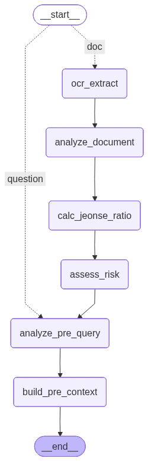
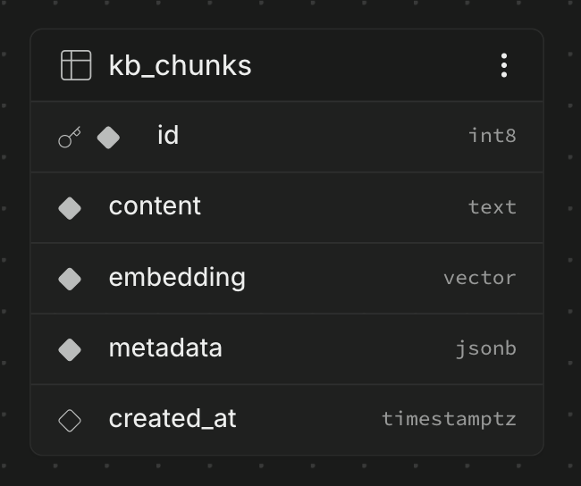

# 시스템 아키텍처

## 1. 오프라인 데이터 파이프라인

```text
data/01_raw        국가법령정보센터 API & 공공 PDF
   ↓ 로드
data/02_loaded      텍스트 추출 체크포인트
   ↓ 전처리
data/03_processed   전처리 (정제·정규화)
   ↓ 청킹
data/04_chunks      청킹 결과 체크포인트
   ↓ 임베딩 (embed_chunks.py, text-embedding-3-small)
data/05_vectordb    임베딩 체크포인트
   ↓ 적재 (ingest_supabase.py)
Supabase kb_chunks   pgvector 테이블 (커밋)
```

## 2. 런타임 RAG 흐름 (LangGraph)

`graph.py` — 의도 분류 → 계약 전 서브그래프(문서 있으면 OCR·위험판정) → 벡터 검색 → 관련성 평가 → 답변 생성 → 충실성 검증.

### 2-1. 부모 그래프


- **intake**: 의도 분류(`chitchat` 잡담 / `legal` 법률 질문) — 모호하면 legal로 안전 처리
- **chitchat**: 검색·법적 고지 없이 짧은 대화형 응답 후 바로 종료
- **pre_contract**: 계약 전 서브그래프 (아래 2-2)
- **retrieve**: `vs_method.search_similar()`로 pgvector 코사인 유사도 검색 (재검색 시 결과 병합으로 recall 누적)
- **grade**: 검색 결과 top-1 유사도 임계값으로 근거 충분 여부 결정론적 판정 (LLM 미사용)
- **rewrite_query**: 근거 부족 시 쿼리 재작성 후 재검색 루프 (최대 2회)
- **generate**: 법령/판례(binding)·사례(persuasive)·실무참고(reference) 근거를 층 분리해 답변 생성
- **verify**: 답변이 검색 근거 + 업로드 서류에 충실한지(환각 여부) 검증 — 불충실하면 **bump_verify** 를 거쳐 재생성 루프 (최대 1회)

### 2-2. 계약 전 서브그래프 (pre_contract)



- 문서 여부 라우팅: 업로드 문서가 있으면 `doc` 경로, 없으면 `question` 경로
- **ocr_extract → analyze_document**: 등기부·계약서 OCR 후 보증금·선순위 채권·특약 등 위험 요소 추출
- **calc_jeonse_ratio → assess_risk**: (보증금+선순위)/매매시세 전세가율 계산 후 임계값 기반 위험 등급 판정 (결정론)
- **analyze_pre_query**: 대화 맥락을 반영해 독립형 검색 쿼리 + 쟁점 태그 생성 (두 경로 합류 지점)
- **build_pre_context**: 위험 판정 결과를 검색 쿼리·쟁점에 병합해 공통 파이프라인으로 전달

멀티턴은 그래프 루프가 아니라 `MemorySaver` + `thread_id`로 상태를 유지하며 매 턴 재호출한다.

## 3. 벡터 DB 스키마

```sql
kb_chunks (
  id         BIGSERIAL PRIMARY KEY,
  content    TEXT NOT NULL,
  embedding  VECTOR(1024) NOT NULL,   -- text-embedding-3-small
  metadata   JSONB NOT NULL DEFAULT '{}',
  created_at TIMESTAMPTZ DEFAULT now()
)
```

- `metadata`는 자유 스키마 — `source_type`(statute/precedent/mediation_case 등)에 따라 키가 다름 (법령: `law_name`/`article`, 판례: `court`/`case_no`)
- 공통 필드: `authority`(binding/persuasive/reference), `stage`(pre/post/both), `issue`(태그 리스트)
- 인덱스: `hnsw (embedding vector_cosine_ops)` 유사도 검색용, `gin (metadata)` 필터용
